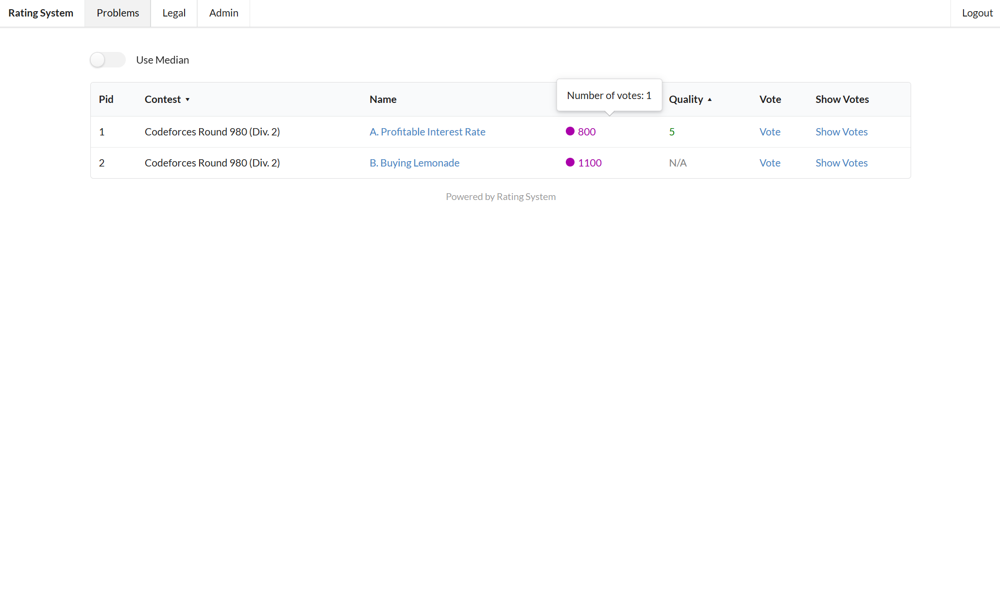

# Rating System

  
  
  
  
   
  
  
  

 

A concise, easy-to-configure, and powerful algorithm competition problems rating system. Developed with Python and Flask.

You can add problems to the system, rate your algorithm competition problems, or use other people's evaluations to filter problems.

## Help

Improve our translation. In `app/i18n`.

## Wiki

[Wiki](https://github.com/ZnPdCo/rating-system/wiki)

## Screenshots

